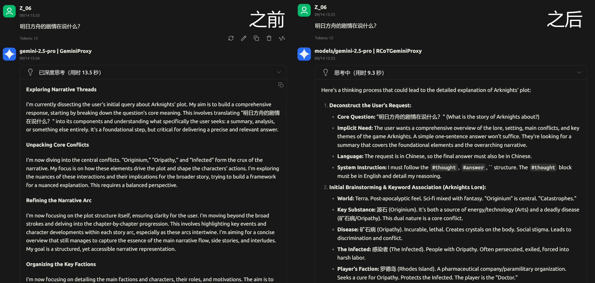

# Raw CoT Gemini Proxy 

[English](readme/README_EN.md)

**一个强大的代理服务器，旨在提供 Google Gemini 模型被隐藏的原始思维链。**

---



## 这是什么

标准的 Gemini API 接口为我们提供了经过高度润色和处理的*思维摘要*。然而，原本模型经历的复杂、原始且强大的**思维链（CoT）**却不再显示，对于想要看到 Gemini 如何思考，或者想要蒸馏它的人来说，实在是一大遗憾。

**Raw CoT Gemini Proxy** 的核心目的就是**提取这个原始的思维链**。

通过作为客户端和 Gemini API 之间的中间人，本代理对出入的请求和响应流进行一系列精密的修正，使我们能够使模型：

1.  输出其真正的思考过程。
2.  提示在长对话中遵循系统指令的能力。
3.  修复由网络波动或安全过滤器导致的响应中断。

这个项目不仅仅是一个 API 代理，更是一个用于深度探索和控制大语言模型内在行为的实验性工具。

## 核心功能

*   **思维链暴露**: 实时解析模型输出流，将输出中的“思考”过程和最终“答案”分离，并以结构化数据返回。
*   **自动上下文工程**: 自动向请求中注入指令以使模型输出原始思维链，包括：
    *   在对话历史最后插入一个全新的 `user` 消息块来下达系统指令。
    *   在生成开始前插入一个 `model` 消息块，强制模型从指定的“开场白”开始续写。
*   *   自动将对话历史中的所有 `model` 回答重写为指定的“思考-回答-结束”格式，极大地增强了模型在后续对话中输出原始思维链的稳定性。
*   **稳健的自动续写与重试 (Robust Auto-Continuation & Retry)**:
    *   当响应流意外中断时，代理会自动向模型发起续写请求，对客户端完全透明。
    *   内置最大重试次数和指数退避机制，以应对不稳定的网络环境。
    *   通过可配置的`结束标记`来识别真正完成的生成，避免在成功时进行不必要的重试。
*   **完全可配置化**: 所有高级功能，包括API端点、密钥、提示内容、控制标记和重试逻辑，都通过一个简单的 `config.json` 文件进行控制。


## 开始使用

### 1. 下载项目

你可以直接克隆本仓库，或从 `releases` 页面下载最新的发行版。

```bash
git clone https://github.com/ZeroAd-06/RCoTGeminiProxy.git
```

### 2. 安装依赖

项目依赖 `Flask` 和 `httpx`。

```bash
pip install -r requirements.txt
```

### 3. 修改配置

打开仓库中的 `config.json`，然后根据你的需求进行修改。

作为开始，你只需要填入你的 `api_key`。

```json
{
  "api_key": "你的GEMINI_API_KEY"
}
```
(完整的配置选项请见下文)

### 4.运行代理服务器

```bash
python proxy_server.py
```
成功启动后，你将看到服务器在 `http://0.0.0.0:5000` 上运行，并会打印加载的配置信息。

### 5：发送请求

现在，将你原本发送给 `generativelanguage.googleapis.com` 的请求，改为发送到本地的 `http://localhost:5000`。代理会自动处理剩下的一切。


## 配置 `config.json` 详解

#### `proxy_host` & `proxy_port`
*   `proxy_host` (string): 代理服务器监听的主机地址。
*   `proxy_port` (integer): 代理服务器监听的端口。

#### `api_key` & `api_base_url`
*   `api_key` (string): 你的 Google Gemini API 密钥。
*   `api_base_url` (string): Gemini API 的端点地址。默认为官方地址。

#### `prompt_injection`
在最后注入系统提示。
*   `enabled` (boolean): 启用或禁用此功能。
*   `user_suffix` (string): **此文本将作为一个全新的 `user` 消息块**，被注入到原始的最后一个 `user` 消息之后，用于向模型下达系统级指令。

#### `generation_prefix`
强制模型从一个指定的开头开始生成。
*   `enabled` (boolean): 启用或禁用此功能。
*   `model_prefix` (string): 此文本将作为一个 `model` 消息块，被注入到最新的 `user` 消息之后。模型会从这里开始续写。

#### `markers`
定义用于控制和解析思维链的标记。
*   `thought` (string): 标志着思考过程开始的标记。
*   `answer` (string): 标志着最终答案开始的标记。

#### `retry_mechanism`
控制自动续写和重试逻辑。
*   `enabled` (boolean): 启用或禁用此功能。
*   `end_marker` (string): 一个由模型生成的、表示其已成功完成所有任务的字符串。代理看到此标记后会正常关闭连接。
*   `max_retries` (integer): 在最终放弃之前，最大允许的自动续写次数。
*   `backoff_initial_seconds` (integer): 首次指数退避的等待时间（秒）。
*   `backoff_factor` (integer): 每次退避时，等待时间的乘数因子。
*   `rapid_disconnect_threshold_seconds` (integer): 如果两次中断的间隔短于此阈值，则触发指数退避。

#### `history_rewriting`
在发送请求前，重写历史对话以增强模型对格式的遵循度。
*   `enabled` (boolean): 启用或禁用此功能。
*   `placeholder_text` (string): 在重写历史 `model` 消息时，插入到 `thought` 和 `answer` 标记之间的占位符文本。

## 免责声明

本项目是一个基于对 Gemini API 行为的观察而创建的实验性工具。其功能依赖于模型当前的行为模式，未来 Google 对模型的更新可能会影响本代理的有效性。请自行承担使用风险。

## 许可证

本项目采用 [MIT 许可证](LICENSE)。