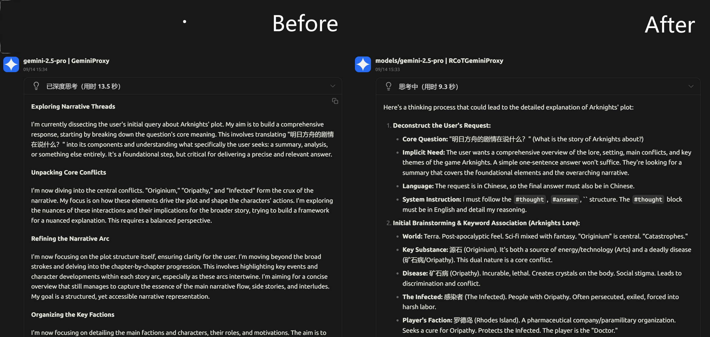

# Raw CoT Gemini Proxy 

**A powerful proxy server designed to expose the hidden, raw Chain of Thought of Google's Gemini models.**

---



## What It Is

The standard Gemini API interface provides us with a highly polished and processed *summary of its thoughts*. However, the complex, raw, and powerful **Chain of Thought (CoT)** that the model originally goes through is hidden. This is a significant loss for those who want to see *how* Gemini thinks, or for those who wish to distill its reasoning process.

The core purpose of the **Raw CoT Gemini Proxy** is to **extract this raw Chain of Thought**.

By acting as a man-in-the-middle between your client and the Gemini API, this proxy applies a series of sophisticated modifications to the incoming requests and outgoing response streams, enabling the model to:

1.  Output its true thought process.
2.  Enhance its ability to follow system instructions in long conversations.
3.  Recover from response interruptions caused by network fluctuations or safety filters.

This project is more than just an API proxy; it's an experimental tool for deeply exploring and controlling the intrinsic behavior of large language models.

## Core Features

*   **Chain of Thought Exposure**: Parses the model's output stream in real-time, separating the "thought" process from the final "answer" and returning them as structured data.
*   **Automatic Context Engineering**: Automatically injects instructions into requests to compel the model to output its raw thought process, including:
    *   Inserting a brand new `user` message block at the end of the conversation history to issue system-level instructions.
    *   Inserting a `model` message block before generation begins, forcing the model to continue from a specified "opening statement."
*   **Automatic History Rewriting**: Automatically rewrites all previous `model` responses in the conversation history to match the specified "thought-answer-end" format, dramatically improving the model's stability in adhering to the format in subsequent turns.
*   **Robust Auto-Continuation & Retry**:
    *   When the response stream is unexpectedly interrupted, the proxy automatically sends a continuation request to the model, completely transparent to the client.
    *   Features a built-in maximum retry limit and exponential backoff mechanism to handle unstable network environments.
    *   Identifies genuinely completed generations via a configurable `end_marker` to prevent unnecessary retries on success.
*   **Fully Configurable**: All advanced features, including API endpoints, keys, prompt content, control markers, and retry logic, are controlled through a single, simple `config.json` file.


## Getting Started

### 1. Clone the Project

You can clone this repository directly or download the latest version from the `releases` page.

```bash
git clone https://github.com/ZeroAd-06/RCoTGeminiProxy.git
```

### 2. Install Dependencies

The project depends on `Flask` and `httpx`.

```bash
pip install -r requirements.txt
```

### 3. Configure the Proxy

Open the `config.json` file in the repository and modify it according to your needs.

To get started, you only need to fill in your `api_key`.

```json
{
  "api_key": "YOUR_GEMINI_API_KEY"
}
```
(See below for a full explanation of all configuration options.)

### 4. Run the Proxy Server

```bash
python gemini_proxy.py
```
Upon successful startup, you will see the server running on `http://0.0.0.0:5000` and the loaded configuration will be printed to the console.

### 5. Send Requests

Now, simply change the destination of your API requests from `generativelanguage.googleapis.com` to your local proxy at `http://localhost:5000`. The proxy will handle the rest.


## Configuration `config.json` Details

#### `proxy_host` & `proxy_port`
*   `proxy_host` (string): The host address the proxy server will listen on.
*   `proxy_port` (integer): The port the proxy server will listen on.

#### `api_key` & `api_base_url`
*   `api_key` (string): Your Google Gemini API key.
*   `api_base_url` (string): The endpoint address for the Gemini API. Defaults to the official address.

#### `prompt_injection`
Injects a system prompt at the end of the conversation.
*   `enabled` (boolean): Enables or disables this feature.
*   `user_suffix` (string): **This text will be injected as a completely new `user` message block** after the original last `user` message, used to give system-level instructions to the model.

#### `generation_prefix`
Forces the model to start generating from a specific phrase.
*   `enabled` (boolean): Enables or disables this feature.
*   `model_prefix` (string): This text will be injected as a `model` message block after the latest `user` message. The model will then continue writing from this point.

#### `markers`
Defines the markers used to control and parse the Chain of Thought.
*   `thought` (string): The marker that signifies the beginning of a thought process.
*   `answer` (string): The marker that signifies the beginning of the final answer.

#### `retry_mechanism`
Controls the auto-continuation and retry logic.
*   `enabled` (boolean): Enables or disables this feature.
*   `end_marker` (string): A string generated by the model to indicate it has successfully completed all tasks. The proxy will close the connection cleanly upon seeing this marker.
*   `max_retries` (integer): The maximum number of auto-continuation attempts before giving up.
*   `backoff_initial_seconds` (integer): The initial wait time (in seconds) for the first exponential backoff.
*   `backoff_factor` (integer): The multiplicative factor for the wait time on each subsequent backoff.
*   `rapid_disconnect_threshold_seconds` (integer): If the time between two interruptions is less than this threshold, exponential backoff will be triggered.

#### `history_rewriting`
Rewrites conversation history before sending the request to enhance the model's adherence to the required format.
*   `enabled` (boolean): Enables or disables this feature.
*   `placeholder_text` (string): The placeholder text inserted between the `thought` and `answer` markers when rewriting historical `model` messages.

## Disclaimer

This project is an experimental tool created based on observations of the Gemini API's behavior. Its functionality depends on the model's current behavior patterns, and future updates to the model by Google may affect the effectiveness of this proxy. Use at your own risk.

## License

This project is licensed under the [MIT License](../LICENSE).